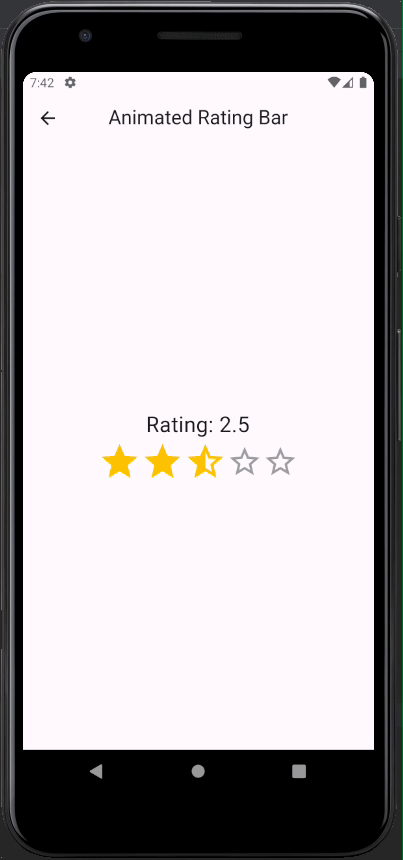
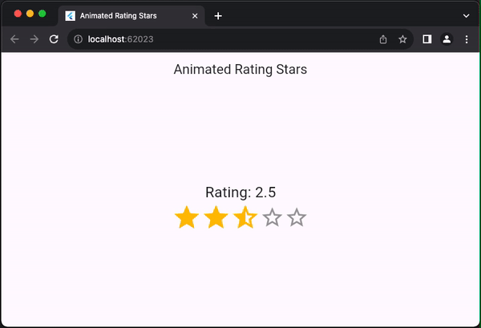
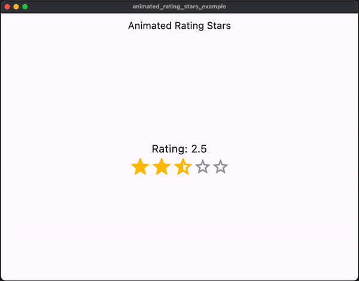

# Animated Rating Stars for Flutter

[](https://pub.dev/packages/animated_rating_stars)
[](https://pub.dev/packages/animated_rating_stars)
[](https://github.com/nikunj22/animated_rating_stars)
[](https://github.com/nikunj22/animated_rating_stars)
[](https://github.com/nikunj22/animated_rating_stars/blob/main/LICENSE)


`AnimatedRatingStars` is a highly customizable animated rating bar widget for Flutter. It allows users to interactively provide ratings by tapping on stars. The package offers a wide range of customization options and is designed to be easy to integrate into your Flutter applications.

## Demo




## Features

- Create animated rating bars with filled, half-filled, and empty stars.
- Customize star colors, icons, sizes, and animation parameters.
- Display the rating value and enable interactive tooltips for half-filled stars.
- Supports both read-only and interactive modes.

## Installation

To use this package, add `animated_rating_stars` as a dependency in your `pubspec.yaml` file:

```yaml
dependencies:
  animated_rating_stars: ^1.0.0
```

Then, run flutter pub get to fetch the package.

## Usage

Import the package in your Dart code:

```dart
import 'package:animated_rating_stars/animated_rating_stars.dart';
```

Now, you can use the AnimatedRatingStars widget in your Flutter app:

```dart
AnimatedRatingStars(
  initialRating: 3.5,
  minRating: 0.0,
  maxRating: 5.0,
  filledColor: Colors.amber,
  emptyColor: Colors.grey,
  filledIcon: Icons.star,
  halfFilledIcon: Icons.star_half,
  emptyIcon: Icons.star_border,
  onChanged: (double rating) {
    // Handle the rating change here
    print('Rating: $rating');
  },
  displayRatingValue: true,
  interactiveTooltips: true,
  customFilledIcon: Icons.star,
  customHalfFilledIcon: Icons.star_half,
  customEmptyIcon: Icons.star_border,
  starSize: 30.0,
  animationDuration: Duration(milliseconds: 300),
  animationCurve: Curves.easeInOut,
  readOnly: false,
)
```

Customize the properties according to your requirements. The onChanged callback is called when the rating changes.

For more examples and usage details, refer to the example directory included with this package.

## Customization

You can customize the appearance and behavior of the rating bar using the following properties:

- `initialRating`: The initial rating value.
- `minRating`: The minimum rating value.
- `maxRating`: The maximum rating value.
- `filledColor`: The color for filled stars.
- `emptyColor`: The color for empty stars.
- `filledIcon`: The icon used for filled stars.
- `halfFilledIcon`: The icon used for half-filled stars.
- `emptyIcon`: The icon used for empty stars.
- `displayRatingValue`: Show or hide the rating value.
- `interactiveTooltips`: Enable interactive tooltips for half-filled stars.
- `customFilledIcon`: Use a custom icon for filled stars.
- `customHalfFilledIcon`: Use a custom icon for half-filled stars.
- `customEmptyIcon`: Use a custom icon for empty stars.
- `starSize`: Set the size of each star.
- `animationDuration`: Adjust the duration of the animation when the rating changes.
- `animationCurve`: Define the animation curve for the rating change.
- `readOnly`: Make the widget read-only.

## Customization

Contributions and feedback are welcome! If you encounter any issues or have feature requests, please open an issue on GitHub.

## License

This package is distributed under the MIT License. See LICENSE for details.

For more Flutter packages and development resources, visit <a href="https://pub.dev/">pub.dev</a>.